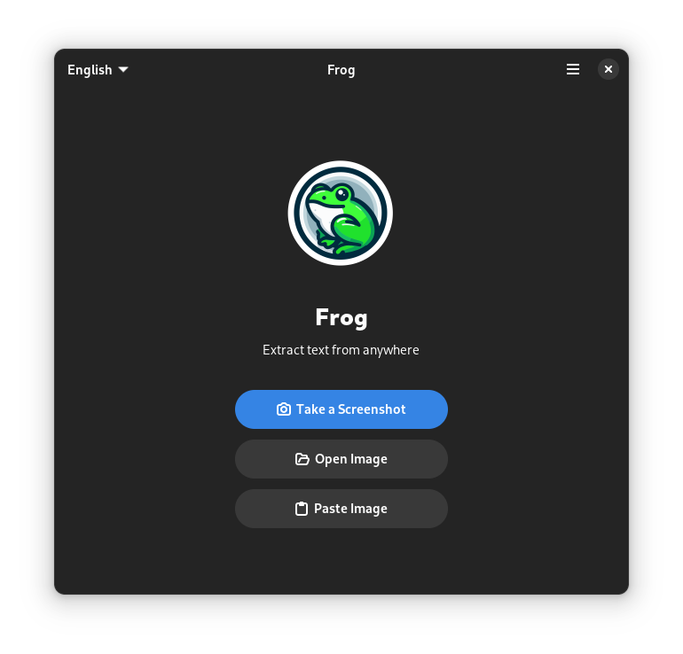

# Frog 🐸

> Intuitive text extraction tool (OCR) for GNOME.

<a href="https://hosted.weblate.org/engage/frog/">

</a>


<div align="center">
<figure>

</figure>
</div>

Quickly extract text from almost any source: youtube, screencasts, PDFs, webpages, photos, etc.
Grab the image and get the text.

The Frog could help you to deal with QR codes helping you to get them decoded!

## What's in this repo?

A modern Rust rewrite of [Frog](https://github.com/TenderOwl/Frog), the screenshot and OCR tool for GNOME. Frog aims to provide a fast, reliable, and user-friendly way to capture screenshots and extract text using OCR (Optical Character Recognition).

## Features

- **Screenshot Capture**: Easily capture screenshots of your screen or specific regions.
- **OCR Support**: Extract text from images using modern OCR engines.
- **GNOME Integration**: Seamless integration with the GNOME desktop environment.
- **User-Friendly Interface**: Intuitive and easy-to-use interface.

## Installation

### From Source

To build and install Frog from source, follow these steps:

1. **Clone the Repository**:
   ```bash
   git clone https://github.com/tenderowl/Frog.git
   cd Frog
   ```

2. **Install Dependencies**:
   Ensure you have the following dependencies installed:
   - Rust (latest stable version)
   - Cargo (Rust's package manager)
   - Meson (build system)
   - Ninja (build tool)
   - GTK 4 (for the GUI)
   - libadwaita (for GNOME integration)

   On Debian/Ubuntu-based systems, you can install these dependencies with:
   ```bash
   sudo apt-get install rustc cargo meson ninja-build libgtk-4-dev libadwaita-1-dev
   ```

3. **Build and Install**:
   ```bash
   meson setup builddir --prefix=/usr
   cd builddir
   ninja
   sudo ninja install
   ```

## Usage

Once installed, you can launch Frog from your application menu or by running:

```bash
frog
```

### Basic Workflow

1. **Capture a Screenshot**: Use the screenshot tool to capture the desired region.
2. **Extract Text**: Use the OCR tool to extract text from the captured image.
3. **Copy or Save**: Copy the extracted text to your clipboard or save it to a file.

## Development

### Getting Started

To start developing Frog, follow these steps:

1. **Clone the Repository**:
   ```bash
   git clone https://github.com/tenderowl/Frog.git
   cd Frog
   ```

2. **Install Development Dependencies**:
   Ensure you have the following dependencies installed:
   - Rust (latest stable version)
   - Cargo (Rust's package manager)
   - Meson (build system)
   - Ninja (build tool)
   - GTK 4 (for the GUI)
   - libadwaita (for GNOME integration)

   On Debian/Ubuntu-based systems, you can install these dependencies with:
   ```bash
   sudo apt-get install rustc cargo meson ninja-build libgtk-4-dev libadwaita-1-dev
   ```

3. **Build the Project**:
   ```bash
   meson setup builddir --prefix=/usr
   cd builddir
   ninja
   ```

4. **Run the Application**:
   ```bash
   ninja run
   ```

### Contributing

We welcome contributions from the community! If you'd like to contribute to Frog, please follow these guidelines:

1. **Fork the Repository**: Fork the Frog repository on GitHub.
2. **Create a Branch**: Create a new branch for your feature or bug fix.
3. **Make Changes**: Make your changes and commit them with clear, descriptive messages.
4. **Submit a Pull Request**: Submit a pull request to the main repository.

### Code Style

- Follow the Rust style guidelines.
- Use clear and descriptive variable and function names.
- Write comments to explain complex logic.
- Ensure your code is well-tested.

### Bug Reports

If you encounter any bugs or issues, please report them on the [GitHub Issues](https://github.com/tenderowl/Frog/issues) page. Include as much detail as possible, such as:

- Steps to reproduce the issue
- Expected behavior
- Actual behavior
- Screenshots or logs (if applicable)

## License

Frog is licensed under the MIT License. See the [COPYING](COPYING) file for more details.

## Contact

For questions, suggestions, or feedback, please open an issue on the [GitHub Issues](https://github.com/tenderowl/Frog/issues) page.

---

Happy coding! 🐸🚀
